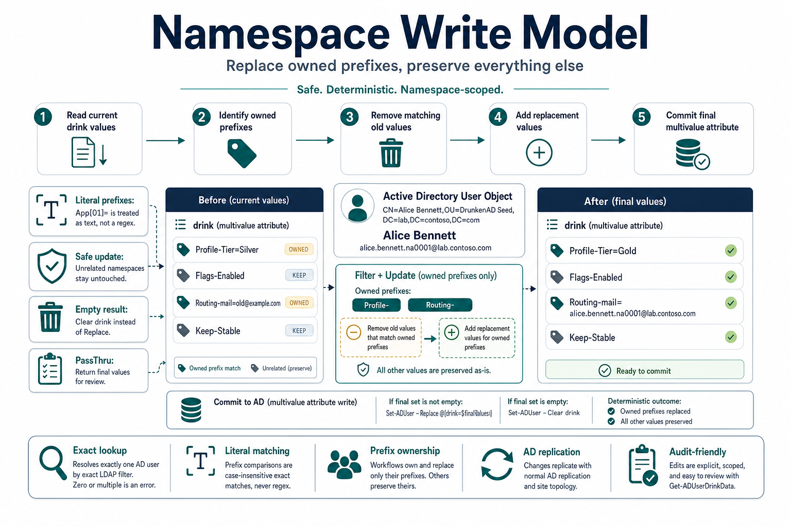
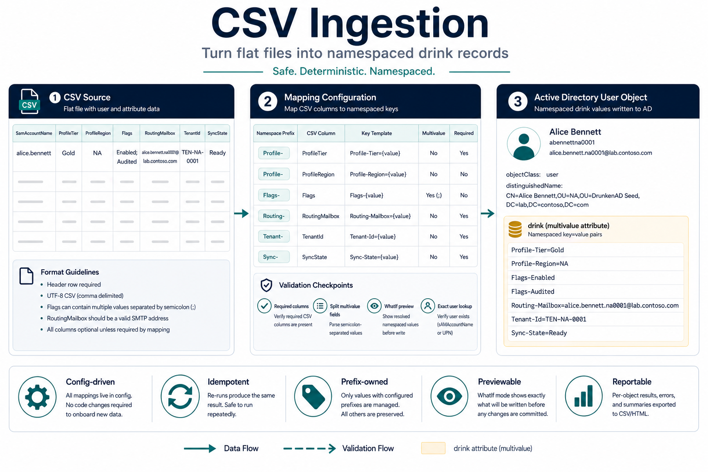

# DrunkenAD Architecture

DrunkenAD is a PowerShell module with a narrow job: resolve one AD user, treat
that user's multivalued `drink` attribute as a literal-prefix store, and write
only the namespaces the caller owns.

The source diagram for this page lives at
[diagrams/namespace-write-model.mmd](diagrams/namespace-write-model.mmd).

## Core Boundary

The module does not create a new backend. Active Directory remains the storage
system, and `drink` remains a normal AD attribute. DrunkenAD provides guardrails
around lookup, prefix matching, replacement semantics, and live readiness.

The main public commands are:

| Command | Responsibility |
| --- | --- |
| `Get-ADUserDrinkData` | Read all `drink` values or one literal prefix. |
| `Set-ADUserDrinkData` | Replace one or more owned prefixes. |
| `Remove-ADUserDrinkData` | Remove one or more owned prefixes. |
| `Set-ADUserDrinkProjection` | Project AD attributes into namespaced records. |
| `Import-ADUserDrinkCsvData` | Convert CSV rows into namespace maps and write them. |
| `Split-DrunkenADCsvField` | Preview the same literal delimiter splitting used by CSV `SplitOn` mappings. |
| `Test-ADDrinkAttributeReadyForUserWrite` | Confirm the schema is ready for user-object writes. |

Compatibility commands remain available for older call sites, but new code
should use the `DrinkData` and projection names.

## Write Semantics

Every write follows the same conceptual sequence:

1. Confirm `drink` exists and is legal on `user`.
2. Resolve exactly one user by an exact LDAP lookup.
3. Read the current `drink` values.
4. Remove existing values that match the owned prefixes literally.
5. Add the new values for those prefixes.
6. Preserve unrelated values.
7. Use `Clear` when the final value set is empty, otherwise use `Replace`.

The literal-prefix rule is important. A prefix such as `Literal[01]-` is treated
as text, not a regular expression.

## Ingestion And Projection

CSV ingestion and projection both build a `DataMap`, then call the generic write
path.

The source diagram for this flow lives at
[diagrams/csv-ingestion-flow.mmd](diagrams/csv-ingestion-flow.mmd).

CSV ingestion starts from rows and a namespace map. A mapping may opt into
multivalue expansion with `SplitOn`; only that column is split, and the
delimiter is treated literally. Projection starts from AD attributes and an
attribute map. After that, both paths share the same safety behavior.

## Failure Boundaries

The module fails early when:

- the AD module is unavailable
- `drink` is missing, defunct, or not legal on `user`
- a user lookup returns zero or multiple users
- the CSV file is missing required mapped columns
- a live write fails in AD

Those failures are intentional. The module should not silently skip ambiguous
identity resolution or continue after schema-readiness failure.
