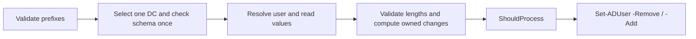
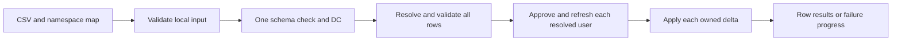

# DrunkenAD Architecture

DrunkenAD is a PowerShell module with a narrow job: resolve one AD user, treat
that user's multivalued `drink` attribute as a literal-prefix store, and write
only the namespaces the caller owns.

See the current [module layout diagram](DIAGRAMS.md#module-layout) and its
[Mermaid source](diagrams/module-layout.mmd).

## Core Boundary

The module does not create a new backend. Active Directory remains the storage
system, and `drink` remains a normal AD attribute. DrunkenAD provides guardrails
around lookup, prefix matching, replacement semantics, and live readiness.

The root module dot-sources focused files from `DrunkenAD/Private` and
`DrunkenAD/Public`. Private files hold shared helpers for schema checks, lookup,
prefix maps, shared write operations, projection maps, logging, and CSV mapping. Public files hold the
exported commands and compatibility wrappers listed in the manifest.

The main public commands are:

| Command | Responsibility |
| --- | --- |
| `Get-ADUserDrinkData` | Read all `drink` values or one literal prefix. |
| `Set-ADUserDrinkData` | Replace one or more owned prefixes. |
| `Remove-ADUserDrinkData` | Remove one or more owned prefixes. |
| `Set-ADUserDrinkProjection` | Project AD attributes into namespaced records. |
| `Import-ADUserDrinkCsvData` | Convert CSV rows into namespace maps and write them. |
| `Split-DrunkenADCsvField` | Preview the same literal delimiter splitting used by CSV `SplitOn` mappings. |
| `Test-ADDrinkAttributeReadyForUserWrite` | Confirm the schema is ready for user-object writes. |

Compatibility commands remain available for older call sites, but new code
should use the `DrinkData` and projection names.

Reads check only that the attribute exists and is enabled, then use the same
selected endpoint for the user lookup. They do not traverse the class graph or
depend on write readiness. Explicit hosts, IPs, aliases, and tunnel endpoints
are preserved. Only absent servers or DNS names matching RootDSE's default
domain are pinned to its controller hostname; explicit ports are retained.
An alias remains the operator's responsibility if it can route to multiple DCs.

## Write Semantics

The source diagram for this write model lives at
[diagrams/namespace-write-model.mmd](diagrams/namespace-write-model.mmd).

Every write follows the same conceptual sequence:

1. Select a DC and confirm `drink` is legal on `user`, including inherited and
   auxiliary classes. Reuse that result for the operation.
2. Resolve exactly one user by an exact LDAP lookup.
3. Read the current `drink` values.
4. Validate prefixed value lengths against the schema and compute changes for
   the owned prefixes with ordinal comparisons.
5. Apply only removed and added values in one `Set-ADUser` call after
   `ShouldProcess`; a removal never clears the entire attribute.
6. Return the computed value set on request, including previews.

The literal-prefix rule is important. A prefix such as `Literal[01]-` is treated
as text, not a regular expression.

## Ingestion And Projection

CSV ingestion and projection both build a `DataMap`, then use the same private
writer and operation context. CSV resolves and validates every usable row
before its first write, then refreshes each approved row's values by resolved
identity immediately before applying its delta. Projection reuses its already
resolved user. CSV and projection summaries include an explicit outcome status.

The source diagram for this flow lives at
[diagrams/csv-ingestion-flow.mmd](diagrams/csv-ingestion-flow.mmd).

CSV ingestion starts from rows and a namespace map. A mapping may opt into
multivalue expansion with `SplitOn`; only that column is split, and the
delimiter is treated literally. Projection starts from AD attributes and an
attribute map. Both replace every mapped prefix, including empty namespaces.
The shipped CSV config uses separate prefixes from the built-in projection so
the two workflows preserve each other's data.

## Failure Boundaries

The module fails early when:

- the AD module is unavailable
- `drink` is missing, defunct, or not legal on `user`
- a user lookup returns zero or multiple users
- the CSV file is missing required mapped columns
- a live write fails in AD

Those failures are intentional. The module should not silently skip ambiguous
identity resolution or continue after schema-readiness failure.

See [DATA-STORE.md](DATA-STORE.md) for same-prefix and cross-DC concurrency
limits. Activity logs contain ObjectGUID correlation and counts, not account
names or attribute payloads. Protect these persistent identifiers as operational data.
