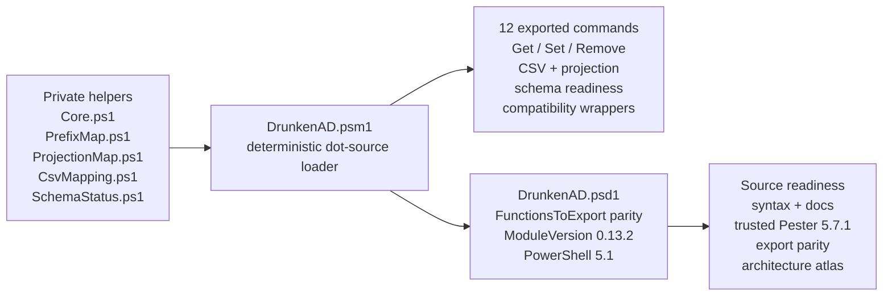
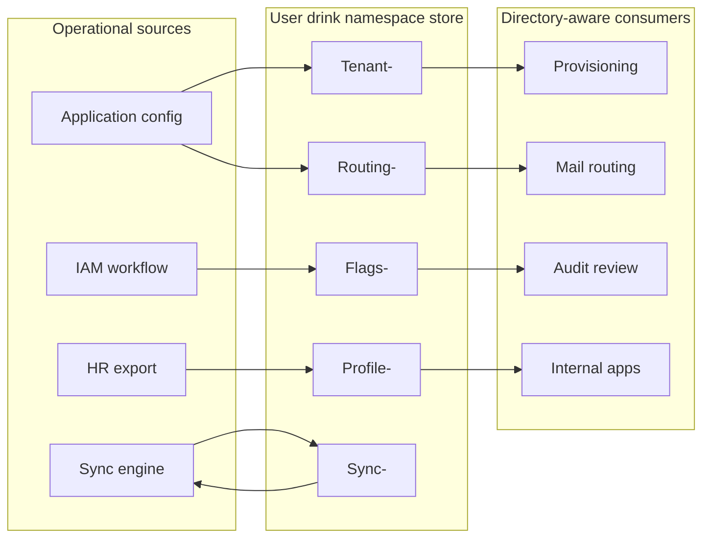
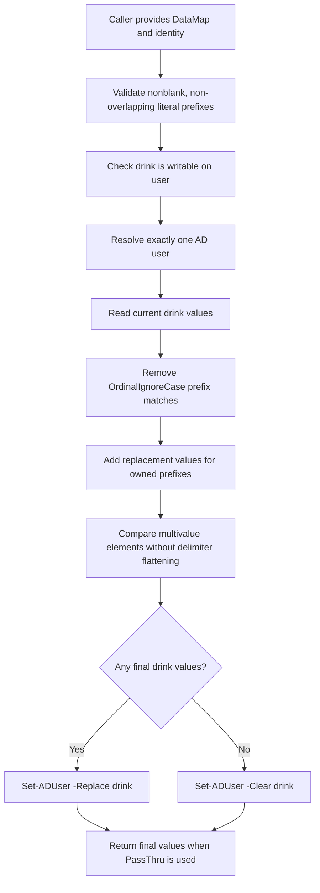
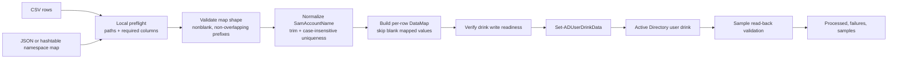
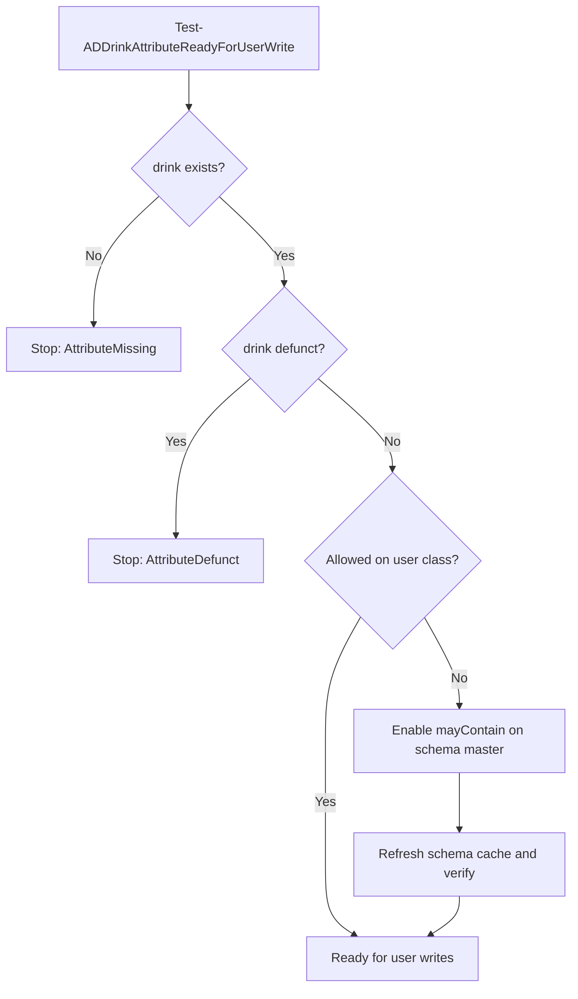
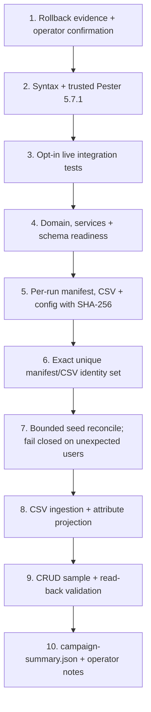
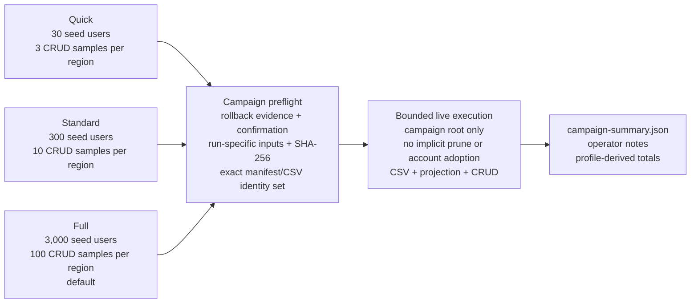
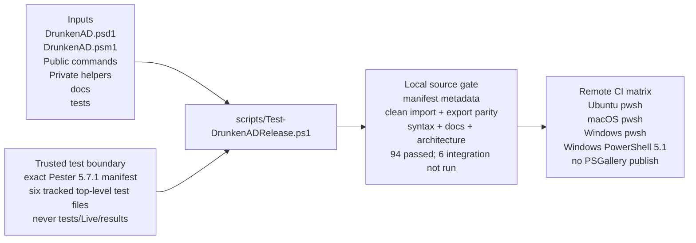

# DrunkenAD Diagrams

This page keeps the Mermaid diagrams and their generated infographic plates
together. The Mermaid files under `docs/diagrams/` are the editable source of
truth. The PNG images under `docs/images/documentation-suite-2026-05-07/` and
`docs/images/documentation-suite-2026-05-11/` are page-facing explanations with
labels, examples, and workflow context.

## Product Overview

Use this image when introducing the whole project: schema readiness, CSV
ingestion, projection, namespace updates, live validation, and reporting all
around the same `drink` attribute model.

## Module Layout

Source file: [diagrams/module-layout.mmd](diagrams/module-layout.mmd)

## Use-Case Map

Source file: [diagrams/use-case-map.mmd](diagrams/use-case-map.mmd)

## Namespace Write Model

Source file: [diagrams/namespace-write-model.mmd](diagrams/namespace-write-model.mmd)

## CSV Ingestion Flow

Source file: [diagrams/csv-ingestion-flow.mmd](diagrams/csv-ingestion-flow.mmd)

## Schema Readiness Flow

Source file: [diagrams/schema-readiness-flow.mmd](diagrams/schema-readiness-flow.mmd)

## Live Validation Ladder

Source file: [diagrams/live-validation-ladder.mmd](diagrams/live-validation-ladder.mmd)

## Live Campaign Profiles

Source file: [diagrams/live-campaign-profiles.mmd](diagrams/live-campaign-profiles.mmd)

## Release Readiness

Source file: [diagrams/release-readiness-flow.mmd](diagrams/release-readiness-flow.mmd)
