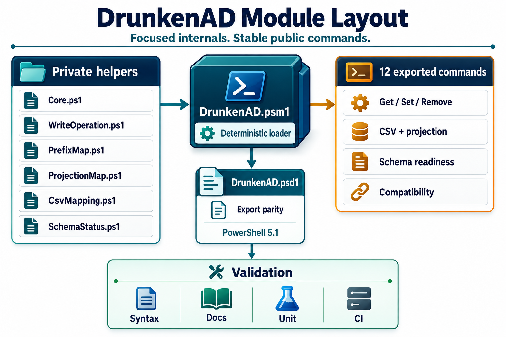
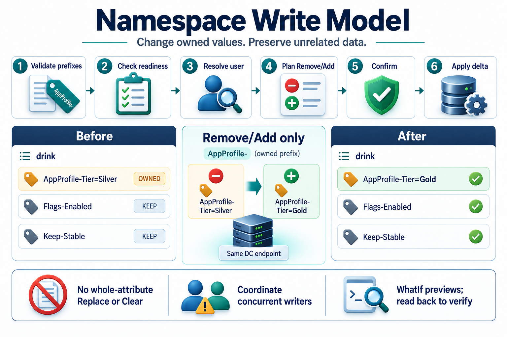
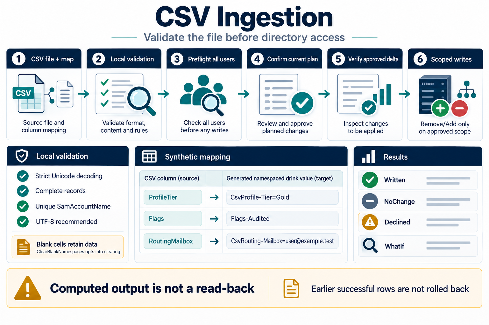
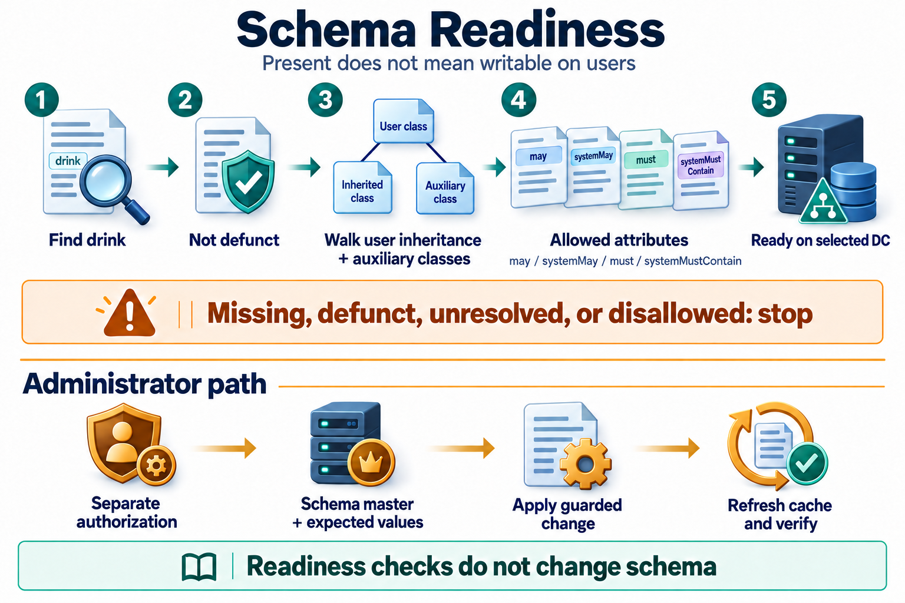
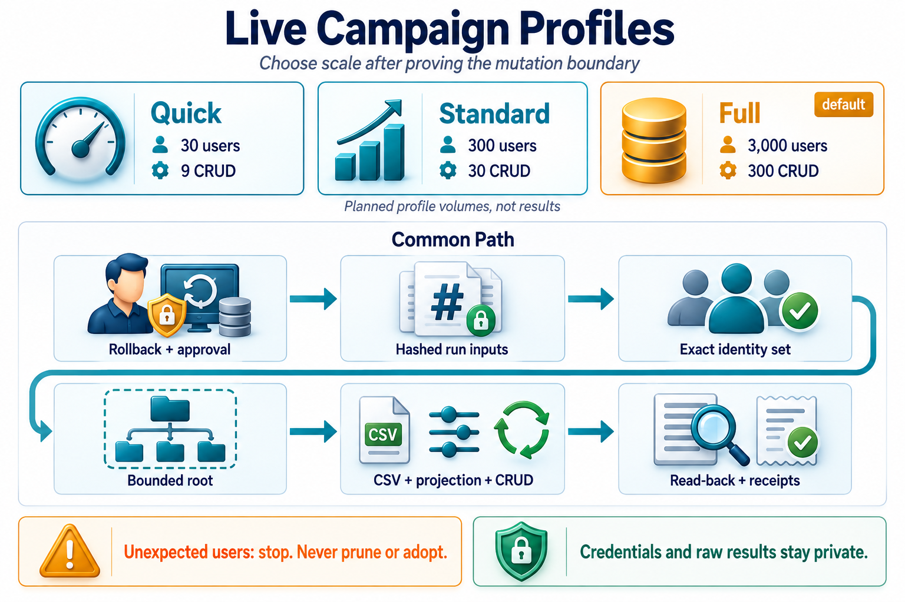
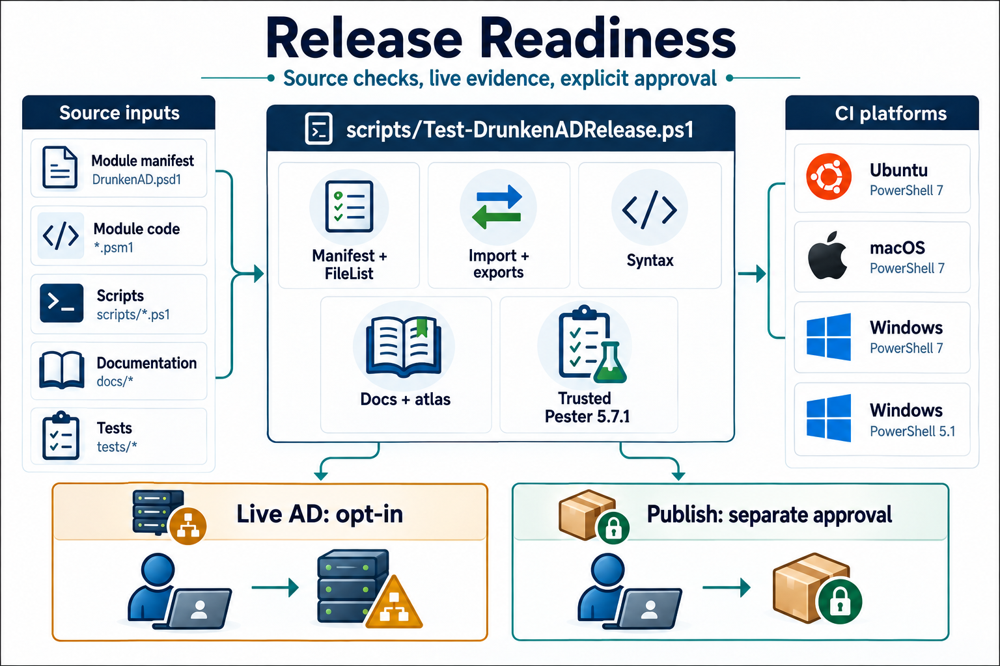

# DrunkenAD Documentation

DrunkenAD turns the multivalued Active Directory `drink` attribute into a small
namespaced data store for user-attached operational metadata.

<p align="center">
  
</p>

The October imagegen refresh restores the illustrated documentation style with
current write, CSV, schema, and validation contracts. The Mermaid flows and
interactive atlas remain the detailed technical views. Artwork explains the
process; it does not establish a passing test or a published release. Older
image suites remain historical references.
The 0.12.1 docs keep the seeded live campaign flow host-method neutral. Use the
integration suite for generic live AD validation, and use
[LIVE-CAMPAIGN-HOSTS.md](LIVE-CAMPAIGN-HOSTS.md) when adding or replacing a host
wrapper for seeded campaigns.

Start with the path that matches your job:

- Learning from PowerShell: run `Get-Help about_DrunkenAD`, then
  `Get-Help <command> -Full` or `Get-Help <command> -Examples`.
- Evaluating the idea: read [USE-CASES.md](USE-CASES.md), then
  [DATA-STORE.md](DATA-STORE.md).
- Implementing an integration: read [ARCHITECTURE.md](ARCHITECTURE.md), then
  [HOW-TO-INGEST-CSV.md](HOW-TO-INGEST-CSV.md).
- Operating the module: read [OPERATIONS.md](OPERATIONS.md), then
  [SCHEMA-ENABLEMENT.md](SCHEMA-ENABLEMENT.md).
- Validating a lab: read [TESTING.md](TESTING.md),
  [LIVE-VALIDATION.md](LIVE-VALIDATION.md), [LIVE-CAMPAIGN-HOSTS.md](LIVE-CAMPAIGN-HOSTS.md), and the recorded
  [WinServer live validation run](WINSERVER-LIVE-VALIDATION-2026-05-07.md).
- Reviewing diagrams: read [DIAGRAMS.md](DIAGRAMS.md), then open the
  [interactive architecture atlas](drunkenad-architecture-map.html).
- Reviewing the October changes: read the
  [external-review adjudication](issues/013-october-review-hardening.md) and
  [post-merge validation matrix](POST-MERGE-VALIDATION.md).

## Document Map

| Document | Purpose |
| --- | --- |
| [USE-CASES.md](USE-CASES.md) | Concrete use cases, anti-use-cases, and namespace examples. |
| [ARCHITECTURE.md](ARCHITECTURE.md) | Module boundaries, data flow, and command responsibilities. |
| [OPERATIONS.md](OPERATIONS.md) | Operator runbook for readiness, writes, ingestion, projection, and rollback. |
| [DATA-STORE.md](DATA-STORE.md) | Core `drink` storage model and namespace semantics. |
| [HOW-TO-INGEST-CSV.md](HOW-TO-INGEST-CSV.md) | CSV ingestion workflow and mapping format. |
| [SCHEMA-ENABLEMENT.md](SCHEMA-ENABLEMENT.md) | Safe schema-readiness enablement path. |
| [TESTING.md](TESTING.md) | Parser, unit, integration, and live campaign test layers. |
| [POST-MERGE-VALIDATION.md](POST-MERGE-VALIDATION.md) | Post-merge review decisions and all 26 proposed live evidence gates. |
| [LIVE-VALIDATION.md](LIVE-VALIDATION.md) | Live validation guide and recorded lab run index. |
| [LIVE-CAMPAIGN-HOSTS.md](LIVE-CAMPAIGN-HOSTS.md) | Generic host-method contract for seeded live campaign wrappers. |
| [DIAGRAMS.md](DIAGRAMS.md) | Mermaid source plus information-dense infographic plates. |
| [drunkenad-architecture-map.html](drunkenad-architecture-map.html) | Self-contained interactive rollover atlas for the whole repo, with map data embedded for local file use. |
| [drunkenad-architecture-map-external.html](drunkenad-architecture-map-external.html) | External-data version of the atlas that loads [drunkenad-architecture-map.json](drunkenad-architecture-map.json) at runtime. |
| [drunkenad-architecture-map.json](drunkenad-architecture-map.json) | Reusable architecture-map data for the atlas variants and other tooling. |

## Visual Reading Path

| Question | Infographic | Documentation |
| --- | --- | --- |
| What is this for? |  | [USE-CASES.md](USE-CASES.md) |
| How is the module organized? |  | [ARCHITECTURE.md](ARCHITECTURE.md) |
| How are writes kept scoped? |  | [ARCHITECTURE.md](ARCHITECTURE.md) |
| How does flat-file data get into AD? |  | [HOW-TO-INGEST-CSV.md](HOW-TO-INGEST-CSV.md) |
| What must be true before writes? |  | [SCHEMA-ENABLEMENT.md](SCHEMA-ENABLEMENT.md) |
| How do we pick live validation scale? |  | [LIVE-VALIDATION.md](LIVE-VALIDATION.md) |
| How do we prove release readiness? |  | [TESTING.md](TESTING.md) |

## PowerShell Help

The module ships a conceptual help topic plus comment-based help on each
exported function:

```powershell
Get-Help about_DrunkenAD
Get-Help Set-ADUserDrinkData -Full
Get-Help Import-ADUserDrinkCsvData -Examples
Get-Help Remove-ADUserDrinkData -Parameter Prefixes
```

Use repository docs for longer operational context, and use `Get-Help` when you
are at a PowerShell prompt and need command syntax, parameters, examples, or
related commands.

## Safety Themes

- Check `Test-ADDrinkAttributeReadyForUserWrite` before live writes.
- Keep each workflow's owned prefixes explicit.
- Use `-WhatIf` for first runs and reviews.
- Treat `tests/Live/results/` as ignored run output and never commit secrets.
- Use the live campaign only after a snapshot or equivalent rollback point.
