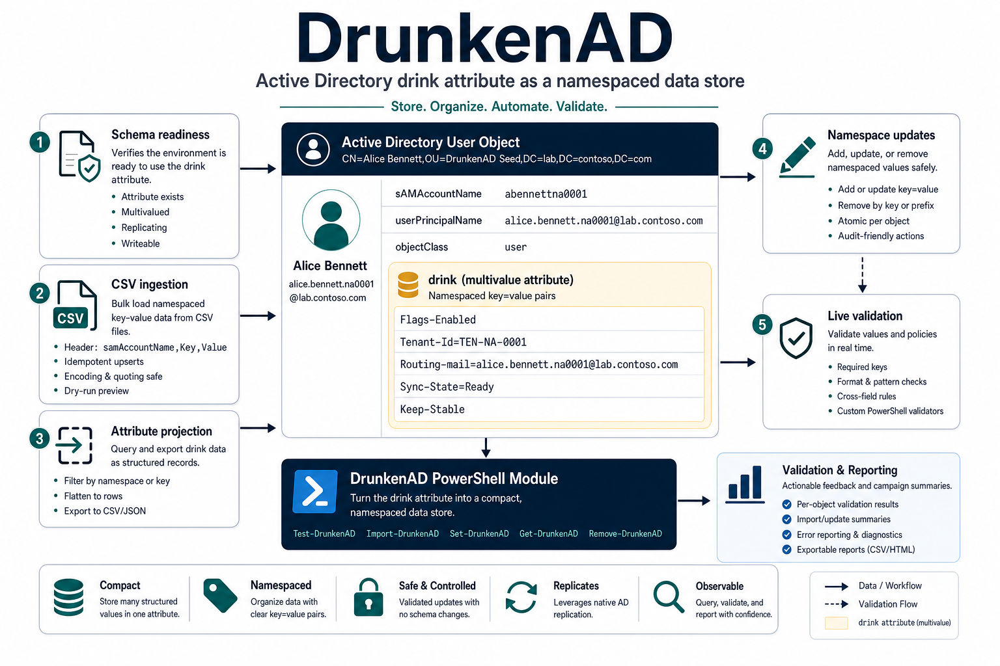
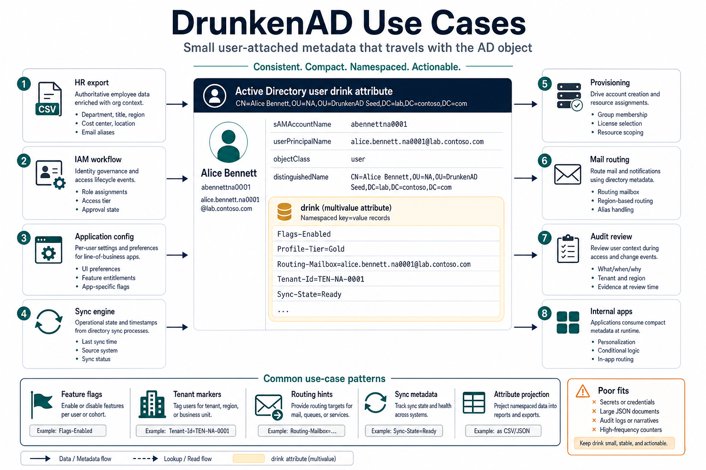
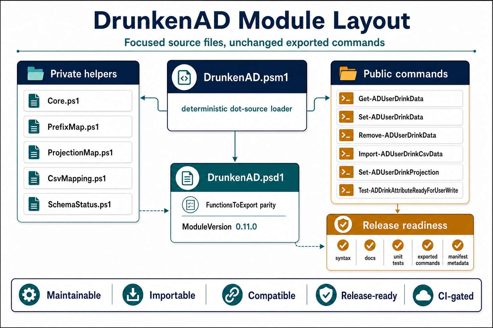
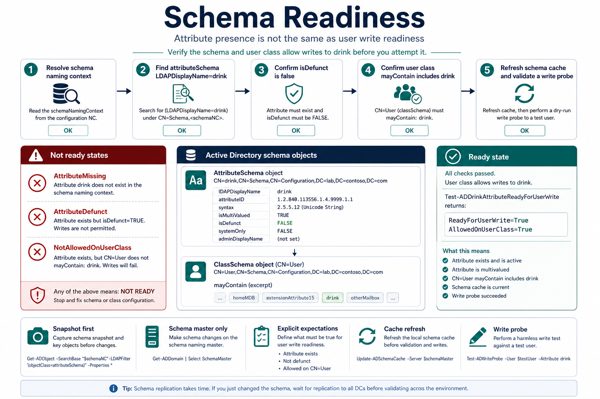
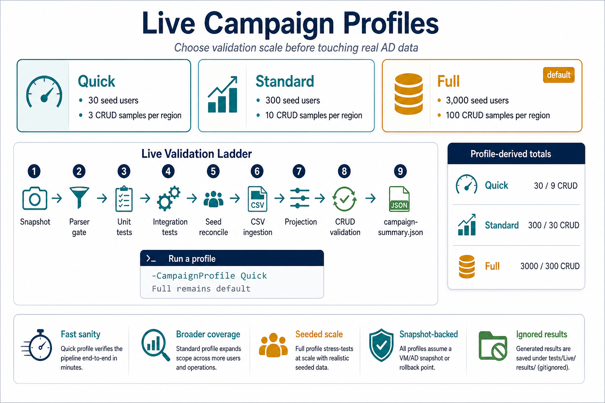
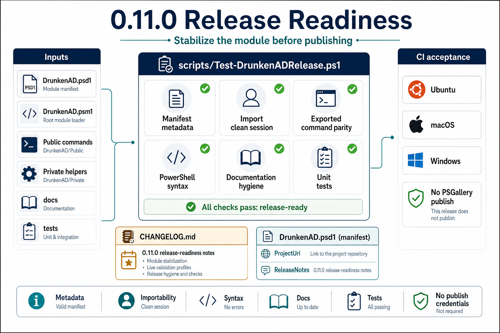

# DrunkenAD Documentation

DrunkenAD turns the multivalued Active Directory `drink` attribute into a small
namespaced data store for user-attached operational metadata.

  

The generated infographic plates are intentionally part of the reading path.
They are not replacements for the Mermaid sources; they are fast, visual
introductions to the same flows that the docs describe in detail.
The 2026-05-11 image suite adds the 0.11.0 module split, campaign profiles, and
release-readiness gate to the same visual style.

Start with the path that matches your job:

- Evaluating the idea: read [USE-CASES.md](USE-CASES.md), then
  [DATA-STORE.md](DATA-STORE.md).
- Implementing an integration: read [ARCHITECTURE.md](ARCHITECTURE.md), then
  [HOW-TO-INGEST-CSV.md](HOW-TO-INGEST-CSV.md).
- Operating the module: read [OPERATIONS.md](OPERATIONS.md), then
  [SCHEMA-ENABLEMENT.md](SCHEMA-ENABLEMENT.md).
- Validating a lab: read [TESTING.md](TESTING.md),
  [LIVE-VALIDATION.md](LIVE-VALIDATION.md), and the recorded
  [WinServer live validation run](WINSERVER-LIVE-VALIDATION-2026-05-07.md).
- Reviewing diagrams: read [DIAGRAMS.md](DIAGRAMS.md).

## Document Map

| Document | Purpose |
| --- | --- |
| [USE-CASES.md](USE-CASES.md) | Concrete use cases, anti-use-cases, and namespace examples. |
| [ARCHITECTURE.md](ARCHITECTURE.md) | Module boundaries, data flow, and command responsibilities. |
| [OPERATIONS.md](OPERATIONS.md) | Operator runbook for readiness, writes, ingestion, projection, and rollback. |
| [DATA-STORE.md](DATA-STORE.md) | Core `drink` storage model and namespace semantics. |
| [HOW-TO-INGEST-CSV.md](HOW-TO-INGEST-CSV.md) | CSV ingestion workflow and mapping format. |
| [SCHEMA-ENABLEMENT.md](SCHEMA-ENABLEMENT.md) | Safe schema-readiness enablement path. |
| [TESTING.md](TESTING.md) | Parser, unit, integration, and live campaign test layers. |
| [LIVE-VALIDATION.md](LIVE-VALIDATION.md) | Live validation guide and recorded lab run index. |
| [DIAGRAMS.md](DIAGRAMS.md) | Mermaid source plus information-dense infographic plates. |

## Visual Reading Path

| Question | Infographic | Documentation |
| --- | --- | --- |
| What is this for? |  | [USE-CASES.md](USE-CASES.md) |
| How is the module organized? |  | [ARCHITECTURE.md](ARCHITECTURE.md) |
| How are writes kept scoped? |  | [ARCHITECTURE.md](ARCHITECTURE.md) |
| How does flat-file data get into AD? |  | [HOW-TO-INGEST-CSV.md](HOW-TO-INGEST-CSV.md) |
| What must be true before writes? |  | [SCHEMA-ENABLEMENT.md](SCHEMA-ENABLEMENT.md) |
| How do we pick live validation scale? |  | [LIVE-VALIDATION.md](LIVE-VALIDATION.md) |
| How do we prove release readiness? |  | [TESTING.md](TESTING.md) |

## Safety Themes

- Check `Test-ADDrinkAttributeReadyForUserWrite` before live writes.
- Keep each workflow's owned prefixes explicit.
- Use `-WhatIf` for first runs and reviews.
- Treat `tests/Live/results/` as ignored run output and never commit secrets.
- Use the live campaign only after a snapshot or equivalent rollback point.
