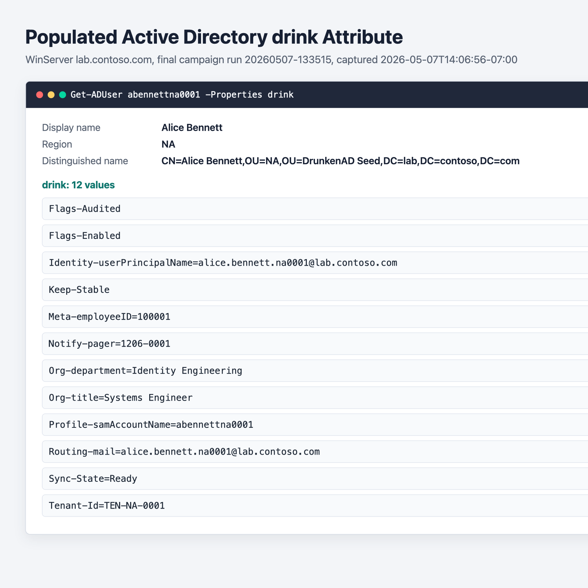
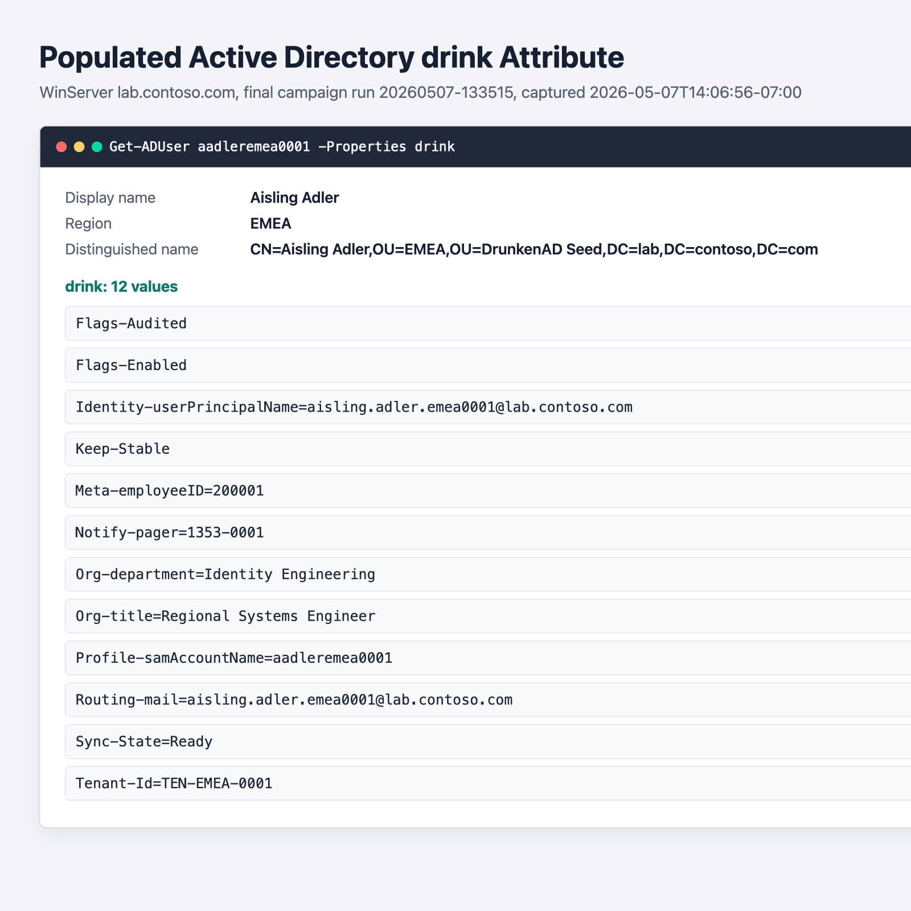
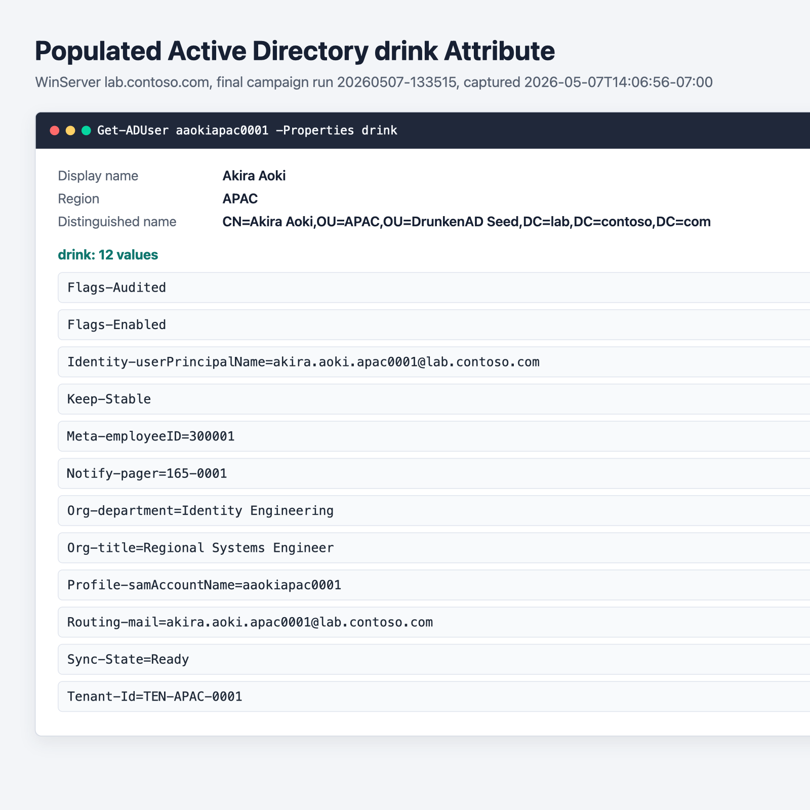

# WinServer Live Validation - 2026-05-07

This note records the May 7, 2026 live validation pass against the Windows Server
2025 AD lab target used for DrunkenAD `drink` attribute testing.

## Target

- Host: `192.168.1.218`
- Hostname: `WinServer` / `WINSERVER`
- Domain: `lab.contoso.com`
- Admin user used for lab tooling: `Administrator`
- Snapshot before mutation: operator-confirmed before live testing
- Final campaign run: `20260507-133515`

## Credential Handling

The server password was collected interactively with `osascript` and stored only
under the ignored results directory:

```sh
mkdir -p tests/Live/results
umask 077
osascript <<'OSA' > tests/Live/results/winserver-lab.password
display dialog "WinServer Administrator password" default answer "" with hidden answer buttons {"OK"} default button "OK"
text returned of result
OSA
chmod 600 tests/Live/results/winserver-lab.password
git check-ignore tests/Live/results/winserver-lab.password
```

Never commit files under `tests/Live/results/`. The run also used ignored
`expect` helpers in that directory for password-backed SSH/SCP automation.

## Reachability And Identity

Read-only reachability checks succeeded after running outside the sandboxed
network path:

- TCP `22` SSH: reachable
- TCP `5985` WinRM HTTP: reachable
- TCP `445` SMB: reachable
- TCP `53` DNS: reachable
- ICMP: 2 of 2 replies, average about 8.8 ms

Remote identity and service checks:

- Host: `WINSERVER`
- Domain: `LAB`
- User: `administrator`
- Windows PowerShell: `5.1.26100.32684`
- AD/DNS services running: `ADWS`, `DNS`, `Kdc`, `Netlogon`, `NTDS`
- Domain DN: `DC=lab,DC=contoso,DC=com`
- Schema master: `WinServer.lab.contoso.com`

## Schema Enablement

Initial schema readiness showed the important half-enabled state:

- `drink` attribute existed: `true`
- `drink` was allowed on `user`: `false`
- ready for user writes: `false`
- blocking reason: `NotAllowedOnUserClass`

Because the VM snapshot was already confirmed, the lab was mutated by adding
`drink` to the `mayContain` list on `CN=User,CN=Schema,CN=Configuration,DC=lab,DC=contoso,DC=com`.
That produced the expected readiness result:

- `drink` attribute existed: `true`
- `drink` was allowed on `user`: `true`
- ready for user writes: `true`

One extra step was required before real writes succeeded: the local AD schema
cache had to be refreshed.

```powershell
$schemaMaster = 'WinServer.lab.contoso.com'
$rootDse = [ADSI]("LDAP://{0}/RootDSE" -f $schemaMaster)
$rootDse.Put('schemaUpdateNow', 1)
$rootDse.SetInfo()
Start-Sleep -Seconds 5
```

Before that refresh, writes still failed with:

```text
An attempt was made to modify an object to include an attribute that is not legal for its class.
```

After the refresh, a raw temporary-user probe successfully wrote and read
`drink = Probe-Ok`.

## Test Layers

The local macOS host did not have `pwsh`, so the PowerShell test stack ran on
WinServer. The remote Windows temp workspace was:

```text
C:\Users\Administrator\AppData\Local\Temp\DrunkenAD_CODEX_20260507-131314
```

The source archive excluded ignored result and credential files. Pester 5.7.1
was staged into the remote temp workspace because the built-in Windows PowerShell
Pester was 3.4.0.

Validation results:

- Parser/import gate: all tracked PowerShell files parsed successfully
- Exported module commands: 11
- Non-integration Pester suite: 43 passed, 0 failed, 0 skipped, 4 not run
- Live integration suite: 47 passed, 0 failed, 0 skipped, 0 not run
- Campaign smoke suite: 4 passed, 0 failed

## Full Campaign Result

Final campaign run `20260507-133515` completed with `Status = Passed`.

| Phase | Result | Duration seconds |
| --- | ---: | ---: |
| Preflight | ready for user writes | 0.144 |
| Smoke | 4 passed, 0 failed | 5.451 |
| Seed reconcile | 3,000 total, 0 failures | 96.174 |
| CSV ingestion | 3,000 processed, 0 failures | 610.424 |
| Projection | 3,000 processed, 0 failures | 877.803 |
| CRUD | 300 processed, 0 failures | 270.731 |

Seed distribution after the final pass:

- `OU=NA,OU=DrunkenAD Seed,DC=lab,DC=contoso,DC=com`: 1,000 users
- `OU=EMEA,OU=DrunkenAD Seed,DC=lab,DC=contoso,DC=com`: 1,000 users
- `OU=APAC,OU=DrunkenAD Seed,DC=lab,DC=contoso,DC=com`: 1,000 users

The final run started at `2026-05-07T13:35:15` and completed at
`2026-05-07T14:06:17` as reported by WinServer.

## Populated Drink Screenshots

The populated `drink` attribute was sampled from one seed user in each region
after CSV ingestion, projection, and CRUD validation completed. Each sample had
12 final `drink` values and retained the CRUD `Keep-Stable` marker.







## Replication Checklist

1. Confirm or create a VM snapshot before mutation.
2. Collect the `Administrator` password with a hidden `osascript` prompt and
   keep it under `tests/Live/results/`.
3. Verify the credential file is ignored by Git and mode `600`.
4. Verify reachability for SSH, WinRM, SMB, DNS, and basic ICMP.
5. Verify AD services: `ADWS`, `DNS`, `Kdc`, `Netlogon`, `NTDS`.
6. Run `Test-ADDrinkAttributeEnabled` and
   `Test-ADDrinkAttributeReadyForUserWrite -PassThru`.
7. If readiness is blocked by `NotAllowedOnUserClass`, use
   [scripts/Enable-ADDrinkAttributeOnUserClass.ps1](../scripts/Enable-ADDrinkAttributeOnUserClass.ps1)
   or an equivalent guarded schema-master update.
8. Force the schema cache refresh with `schemaUpdateNow` and run a direct
   temporary-user write probe before the larger suite.
9. Stage source into a remote temp workspace, excluding `tests/Live/results/`
   and other ignored outputs.
10. Stage Pester 5.x if the host only has Windows PowerShell Pester 3.x.
11. Remove macOS `._*` sidecar files from the remote temp workspace before
   discovery.
12. Run the parser/import gate.
13. Run the non-integration suite.
14. Run the live integration suite with:

```powershell
$env:DRUNKENAD_RUN_INTEGRATION = '1'
$env:DRUNKENAD_TEST_DC = 'WinServer.lab.contoso.com'
$env:DRUNKENAD_TEST_DNS_SUFFIX = 'lab.contoso.com'
.\tests\Invoke-DrunkenADTests.ps1 -IncludeIntegration
```

15. Run the guest campaign with a long SSH/WinRM timeout. A 120-second wrapper
    timeout is too short for the seeded workflow.

```powershell
$root = 'C:\Users\Administrator\AppData\Local\Temp\DrunkenAD_CODEX_YYYYMMDD-HHMMSS'
$run = Get-Date -Format 'yyyyMMdd-HHmmss'
$env:PSModulePath = "$root\Modules;" + $env:PSModulePath

& "$root\tests\Live\Invoke-DrunkenADGuestCampaign.ps1" `
    -RepoRootPath $root `
    -ManifestPath "$root\tests\Live\Data\seed-manifest.json" `
    -CsvPath "$root\tests\Live\Data\seed-ingestion.csv" `
    -ConfigPath "$root\examples\data\drink-ingestion-config.json" `
    -ResultsDirectoryPath "$root\tests\Live\results\$run" `
    -DomainController 'WinServer.lab.contoso.com' `
    -ExpectedDomainDn 'DC=lab,DC=contoso,DC=com' `
    -SnapshotName 'operator-confirmed-snapshot-YYYY-MM-DD' `
    -SnapshotId 'user-confirmed-before-live-testing'
```

## Notes For Next Run

- The full seeded campaign took roughly 31 minutes on this lab host.
- CSV ingestion and projection are the long phases because they perform
  per-user AD lookup, readiness validation, write, and read-back work.
- Interrupting the campaign during seed creation can leave newly-created users
  visible on the next pass. The final clean run reconciled them as unchanged.
- The final projection intentionally replaces the CSV-owned `Profile-` and
  `Routing-` values with projection-owned `Profile-samAccountName=...` and
  `Routing-mail=...` values. This is expected with the current shared-prefix
  campaign design and is worth remembering when reviewing mid-run samples.
